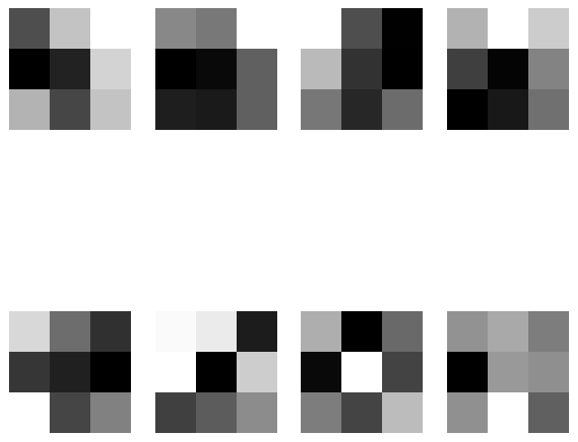

# CNN_filter_visualisation
visualise CNN filter of the last Conv2D layer during training process for each epoch </br>

## Inspiration
Visualisation of Neural Networks in 3D </br>

[](https://youtu.be/hIYR6qMXujE?t=107)

## Visualisation
The filter will be visualised per each epoch during training.

```python
class FilterVisualizer(Callback)
```



## Adjust
Ajust following line in jupyter notebook to visualise other layer

```python
self.final_conv_layer = conv_layers[-1]  # Get the final convolutional layer from the list
```